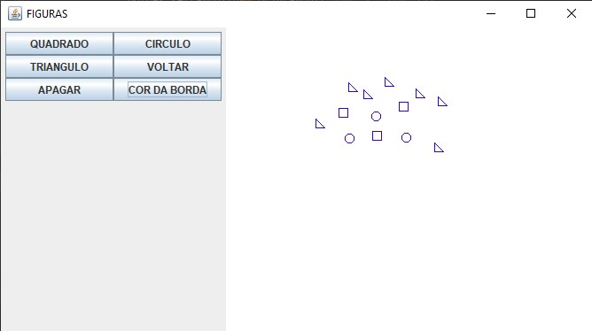

# Padrões - UCSal
> Projeto para criar um editor baseado em padrões de projeto

Projeto feito para a disciplina de Programação Orientada a Objetos Avançada com o objetivo de entender e colocar em prática alguns padrões de projeto e conhecimentos adquiridos durante o semestre. 

## O que já foi implementado
De acordo com as issues propostas, o editor vai evoluindo. Já foi implementado, por exemplo, o desenho de 3 formas geométricas utilizando o awt Graphics; os botões de apagar tudo e voltar; a mudança na cor da linha das figuras desenhadas; Implementação do padrão Factory Method, na criação das figuras;Implementação do padrão Memento para a funcionalidade de 'Voltar';

_Para mais detalhes e ajudar, consulte as issues._

## Histórico
 - [x] Documentar os métodos e classes. #13
 - [ ] Fazer com que o voltar também funcione para mudanças de cor
 - [ ] Salvar arquivo com o desenho em formato csv ou json usar o padrão Builder pattern
 - [x] Utilizar o padrão de projeto Memento para a funcionalidade de voltar pattern
 - [ ] Utilizar o Padrão de Projeto Command para os botões do menu lateral pattern
 - [x] Criação de seleção da cor da linha da figura
 - [ ] Criação de mudança de tamanho
 - [ ] Criar Botão de Exclusão de um unica figura
 - [ ] Separar uma classe responsável por criar a tela, e chamar os componentes referentes a tela 

_Para mais detalhes e ajudar, consulte as issues._

## Contribuindo
Para contribuir, primeiro escolha uma issue, e então siga os passos abaixo:

1. Faça o Fork do projeto (<https://github.com/yourname/padroes>)
2. (Opcional) Crie uma branch da feature a ser implementada (`git checkout -b feature/nomeDaFeature`)
3. Clone e efetue suas mudanças (`git clone https://github.com/yourname/padroes`)
4. Commit suas mudanças (`git commit -m 'Feature #00 implementada'`)
5. Efetue o push para a sua branch remota (`git push origin feature/fooBar`)
6. Crie um novo Pull Request para o repositório original
